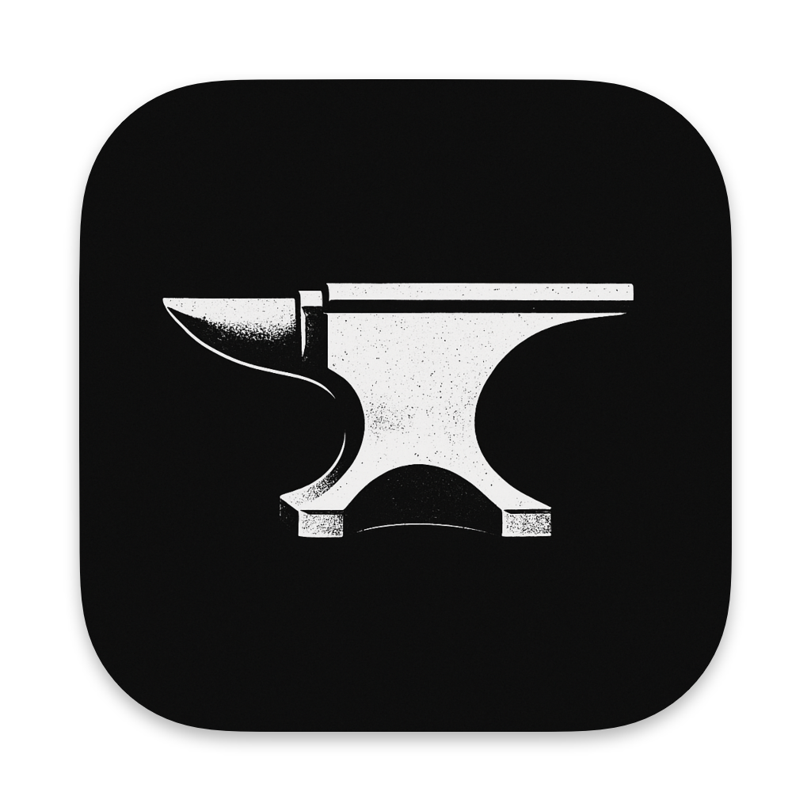

# RepoForge



**Free open-source macOS App That Converts Repositories to LLM-Friendly Text**

## What Makes RepoForge Different

Unlike other repo-to-text tools, RepoForge offers:
- **100% Local Processing** - Your code never leaves your machine
- **Both GitHub & Local Support** - Process remote repos or local folders
- **Native macOS Experience** - Built with Swift for optimal performance
- **Zero Cost** - Completely free and open source

## Building from Source

### Prerequisites

- macOS 13.0+ (Ventura or later)
- Xcode 15.0+ with Swift 6.0+
- Command Line Tools for Xcode

### Build Instructions

1. **Clone the repository:**
   ```bash
   git clone https://github.com/rogierx/RepoForge.git
   cd RepoForge
   ```

2. **Build using the automated script:**
   ```bash
   chmod +x run_repoforge.sh
   ./run_repoforge.sh
   ```

3. **Or build manually:**
   ```bash
   # Clean any previous builds
   rm -rf .build RepoForge.app

   # Build the executable
   swift build --configuration release

   # Create app bundle
   mkdir -p RepoForge.app/Contents/{MacOS,Resources}
   cp .build/arm64-apple-macosx/release/RepoForge RepoForge.app/Contents/MacOS/
   cp appicon.png RepoForge.app/Contents/Resources/

   # Create Info.plist
   cat > RepoForge.app/Contents/Info.plist << 'EOF'
   <?xml version="1.0" encoding="UTF-8"?>
   <!DOCTYPE plist PUBLIC "-//Apple//DTD PLIST 1.0//EN" "http://www.apple.com/DTDs/PropertyList-1.0.dtd">
   <plist version="1.0">
   <dict>
       <key>CFBundleExecutable</key>
       <string>RepoForge</string>
       <key>CFBundleIdentifier</key>
       <string>com.rogierx.RepoForge</string>
       <key>CFBundleVersion</key>
       <string>1.0</string>
       <key>CFBundleShortVersionString</key>
       <string>1.0</string>
       <key>CFBundlePackageType</key>
       <string>APPL</string>
       <key>CFBundleIconFile</key>
       <string>appicon.png</string>
       <key>LSMinimumSystemVersion</key>
       <string>13.0</string>
       <key>NSPrincipalClass</key>
       <string>NSApplication</string>
       <key>NSHighResolutionCapable</key>
       <true/>
   </dict>
   </plist>
   EOF

   # Make executable and launch
   chmod +x RepoForge.app/Contents/MacOS/RepoForge
   open RepoForge.app
   ```

### Build Script Details

The `run_repoforge.sh` script performs these actions:
1. Kills any existing RepoForge instances
2. Cleans previous build artifacts
3. Compiles with Swift Package Manager in release mode
4. Creates proper macOS app bundle structure
5. Copies executable and icon to bundle
6. Generates Info.plist with correct metadata
7. Launches the completed app

### Development

For development builds:
```bash
swift run RepoForge
```

To rebuild after changes:
```bash
rm -rf RepoForge.app .build
./run_repoforge.sh
```

### Troubleshooting

- **Build fails**: Ensure Xcode Command Line Tools are installed: `xcode-select --install`
- **App won't launch**: Check that you have macOS 13.0+ and arm64 architecture
- **Permission denied**: Run `chmod +x run_repoforge.sh` and try again

## Usage

1. Choose GitHub or Local repository
2. Enter URL/token or browse to local folder  
3. Process and export as LLM-ready text

Built for developers who need to feed entire codebases to AI tools like Claude, ChatGPT, or Gemini. 